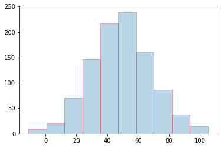
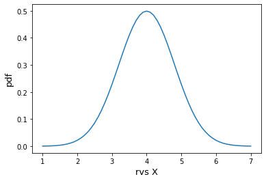
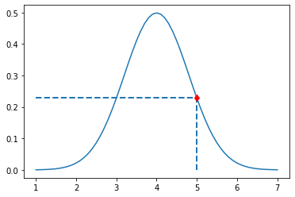
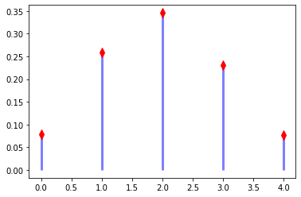
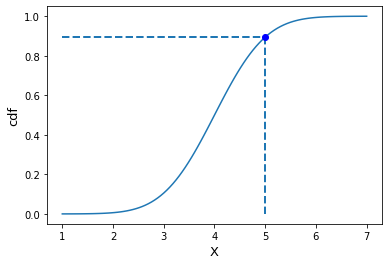

date: 2022-01-06 10:17:17
author: Jerry Su
slug: Scipy-stats
title: Scipy stats
category: 
tags: Machine Learning, Statistics, Scipy
summary: Reason is the light and the light of life.
toc: show


```python
import numpy as np
from scipy import stats
import matplotlib.pyplot as plt
%matplotlib inline
```

### rvs随机变量


```python
norm_rvs = stats.norm.rvs(loc=50, scale=20, size=1000, random_state=0)
norm_rvs[:10]
```


    array([85.28104692, 58.00314417, 69.57475968, 94.81786398, 87.3511598 ,
           30.4544424 , 69.00176835, 46.97285583, 47.93562296, 58.21197004])


```python
plt.hist(norm_rvs, bins=10, alpha=0.3, ec='red')
plt.show()
```


    

    


### pdf概率密度函数

- 表示法：pdf(x, loc=0, scale=1)

- 概率密度表示随机变量X值在定义区域内的相对可能性。

- 简而言之，概率密度函数是通过将**连续类型数据**作为参数来计算概率密度的函数。


```python
X = np.arange(start=1, stop=7.1, step=0.1)
X
```


    array([1. , 1.1, 1.2, 1.3, 1.4, 1.5, 1.6, 1.7, 1.8, 1.9, 2. , 2.1, 2.2,
           2.3, 2.4, 2.5, 2.6, 2.7, 2.8, 2.9, 3. , 3.1, 3.2, 3.3, 3.4, 3.5,
           3.6, 3.7, 3.8, 3.9, 4. , 4.1, 4.2, 4.3, 4.4, 4.5, 4.6, 4.7, 4.8,
           4.9, 5. , 5.1, 5.2, 5.3, 5.4, 5.5, 5.6, 5.7, 5.8, 5.9, 6. , 6.1,
           6.2, 6.3, 6.4, 6.5, 6.6, 6.7, 6.8, 6.9, 7. ])


```python
norm_pdf = stats.norm.pdf(x=X, loc=4, scale=0.8)
norm_pdf
```


    array([4.40744603e-04, 6.98826903e-04, 1.09085337e-03, 1.67639859e-03,
           2.53631007e-03, 3.77782254e-03, 5.53981051e-03, 7.99765039e-03,
           1.13669531e-02, 1.59052270e-02, 2.19103756e-02, 2.97148760e-02,
           3.96745648e-02, 5.21512316e-02, 6.74887081e-02, 8.59828448e-02,
           1.07846649e-01, 1.33172835e-01, 1.61896995e-01, 1.93765332e-01,
           2.28311357e-01, 2.64845807e-01, 3.02463406e-01, 3.40068748e-01,
           3.76421790e-01, 4.10201211e-01, 4.40081658e-01, 4.64818867e-01,
           4.83335146e-01, 4.94797109e-01, 4.98677851e-01, 4.94797109e-01,
           4.83335146e-01, 4.64818867e-01, 4.40081658e-01, 4.10201211e-01,
           3.76421790e-01, 3.40068748e-01, 3.02463406e-01, 2.64845807e-01,
           2.28311357e-01, 1.93765332e-01, 1.61896995e-01, 1.33172835e-01,
           1.07846649e-01, 8.59828448e-02, 6.74887081e-02, 5.21512316e-02,
           3.96745648e-02, 2.97148760e-02, 2.19103756e-02, 1.59052270e-02,
           1.13669531e-02, 7.99765039e-03, 5.53981051e-03, 3.77782254e-03,
           2.53631007e-03, 1.67639859e-03, 1.09085337e-03, 6.98826903e-04,
           4.40744603e-04])


```python
plt.plot(X, norm_pdf)
plt.xlabel("rvs X", fontsize=13)
plt.ylabel("pdf", fontsize=13)
plt.show()
```


    

    


```python
# 计算随机变量为5时的概率密度
x = 5
y = stats.norm.pdf(x=x, loc=4, scale=0.8)
print(f"随机变量x=5时的概率密度：{y}")

# 绘制概率密度函数图
plt.plot(X, norm_pdf)
plt.plot(x, y, 'rd')   # 放置红点

plt.vlines(x, 0.0, y, lw=2, linestyles='dashed') # 垂直线
plt.hlines(y, 1.0, x, lw=2, linestyles='dashed') # 水平线

plt.show()
```

    随机变量x=5时的概率密度：0.2283113567362774


    

    


### pmf概率质量函数

- 表示法：pmf(k, n, p, loc=0)

- 概率质量表示随机变量X的每个离散元素出现的相对容易程度。

- 简而言之，概率质量函数是通过将**离散类型数据**作为参数来计算概率质量的函数。

- 在此，以二项式分布为例，示出"进行5次成功率为40％的试验时，每次成功的概率(0?4次)"。


```python
# 成功概率
p = 0.4
# 实验总次数
n = 5
# 成功次数
k = np.arange(0, 5)

binom_pmf = stats.binom.pmf(k, n, p)

plt.plot(k, binom_pmf, 'rd', ms=8)
plt.vlines(k, 0, binom_pmf, colors='b', lw=3, alpha=0.5)
plt.show()
```


    

    


### cdf累积分布函数

- 表示法：cdf(x, loc=0, scale=1)

- 累积分布函数计算随机变量$ X $小于或等于某个值$ x $的概率。

- 例如，当掷骰子时，"掷骰数为小于等于3"的概率是从1到3的所有概率密度的总和。


```python
# 生成x轴的等差数列
X = np.linspace(start=1, stop=7, num=100)

# cdf生成累积分布函数
norm_cdf = stats.norm.cdf(x=X, loc=4, scale=0.8) # 期待値=4, 標準偏差=0.8

# 用 cdf 计算 x 小于等于 5 的累积概率
under_5 = stats.norm.cdf(x=5, loc=4, scale=0.8) # 期待値=4, 標準偏差=0.8
print('小于等于5的概率：', under_5)

plt.plot(X, norm_cdf)
plt.plot(5, under_5, 'bo')

plt.vlines(5, 0.0, under_5, lw=2, linestyles='dashed') # 垂直线
plt.hlines(under_5, 1.0, 5, lw=2, linestyles='dashed') # 水平线

plt.xlabel("X", fontsize=13)
plt.ylabel("cdf", fontsize=13)

plt.show()
```

    小于等于5的概率： 0.8943502263331446


    

    


```python

```


```python

```
