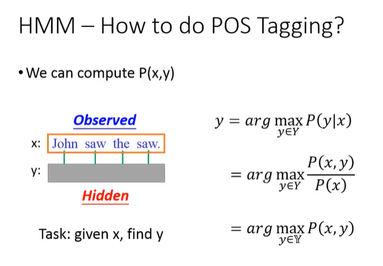
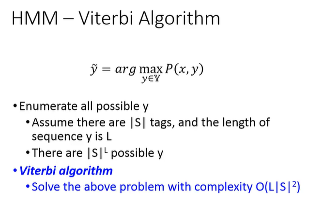

date: 2021-02-18 10:17:17
author: Jerry Su
slug: HMM-Viterbi-Algorithm
title: HMM Viterbi Algorithm
category: 
tags: Deep Learning, NLP, Viterbi, Algorithm, HMM, CRF
summary: Reason is the light and the light of life.
toc: show

### HMM



HMM的问题，就是求解X,Y的观测序列和隐含状态序列的联合概率。



[基于viterbi算法HMM的NER实现](https://zhuanlan.zhihu.com/p/265954764)

[https://www.bilibili.com/video/BV1zJ411575b?t=1724](https://www.bilibili.com/video/BV1zJ411575b?t=1724)

### Viterbi Algorithm 篱笆网络

篱笆网络有向图的特点是同一列节点有多个，并且和上一列节点交错地连接起来。同一列节点代表同一个时间点上不同的状态的并列，因为这种一列一列整齐的节点和交错的边很像篱笆而得名。

篱笆网络的特点：有向、无环图，上一层节点只能指向下一层节点。

L:观测序列长度（输入文本序列），N:隐含状态数（NER的标签数）

穷举法: $O(N^L)$

Viterbi法: $O(L*N^2)$

#### 关键要素

- 隐含状态集合（数目为N）

- 观测值集合（数目为L）

- 隐含状态转移概率矩阵（A，维度为N*N）

- 观测发射概率矩阵（B，维度为L*N）

- 初始隐含状态概率向量（π，维度为N*1）


### Viterbi Algorithm

Viterbi算法解决篱笆型有向图的最短路径问题。目标：**预测概率最大的隐含状态序列**

Viterbi算法本质：动态规划+回溯，找到最优选择路径。**取每一个时间步观测点对应的最大概率的隐含状态，即局部最优解，隐含序列状态连乘后并不能得到全局最优解。因为并没有考虑到时间步之间隐含状态状态转移的概率的最大化。例如存在相邻两个最大概率的隐含状态，但是这两个状态转移的概率很小或者不存在，所以无法获得全局最优解，甚至是不存在的隐含状态序列解。**

凡是使用隐含马尔可夫模型描述的问题都可以用Viteribi法来解码，包括今天的数字通信、语音识别、机器翻译、拼音转汉字、分词等。—《数学之美》

- Viterbi与HMM的关系？

Viterbi是解决HMM第三个问题的一种具体实现算法。

### **HMM  -> CRF -> BERT -> BERT+CRF**

> 引子：当初用BERT模型做答案抽取任务时（类似NER），模型抽取的句子总是出现截断的残句，通过在BERT模型添加CRF头后，解决了这一个问题。为什么CRF可以解决？原理是怎样的？


[通俗讲解Viterbi](https://www.zhihu.com/question/20136144)

[Coding the Viterbi algorithm in Numpy](https://ben.bolte.cc/viterbi)

[维特比算法](https://wulc.me/2017/03/02/%E7%BB%B4%E7%89%B9%E6%AF%94%E7%AE%97%E6%B3%95/)

[HMM-CRF-LSTM的区别与联系](https://zhuanlan.zhihu.com/p/61227299)

### 迭代法

### 矩阵法


```python

```
