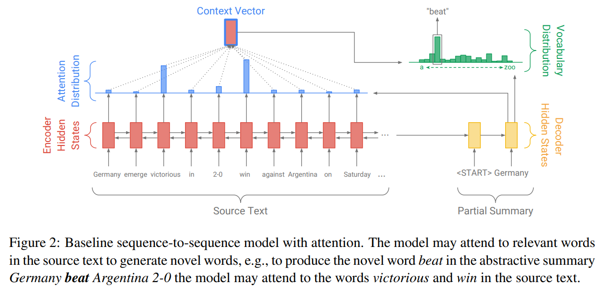
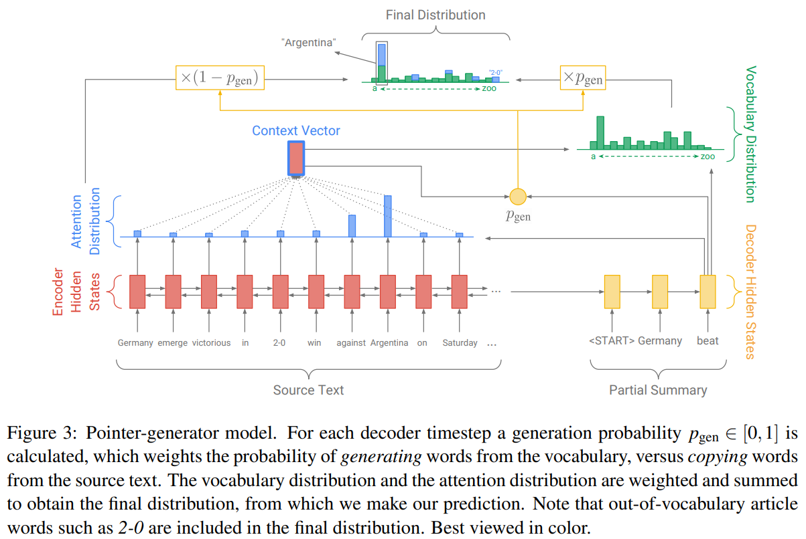
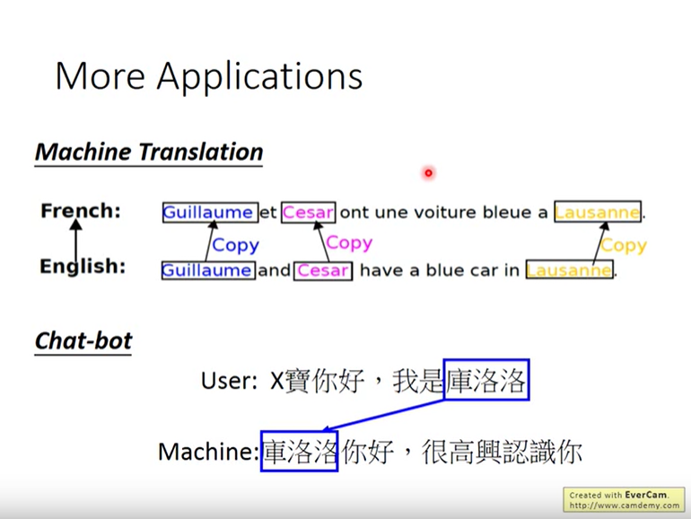

date: 2021-02-25 10:17:17
author: Jerry Su
slug: Pointer-Networkers
title: Pointer Networkers
category: 
tags: Deep Learning, NLP

## Pointer Networkers

A new neural architecture to learn the conditional probability of an output sequence with elements that are discrete tokens corresponding to positions in an input sequence.

解码器可以输出依赖于输入的内容。

- [Oriol Vinyals, Meire Fortunato, and Navdeep Jaitly. 2015. Pointer networks. In Advances in Neural Information Processing Systems, pages 2692–2700.](https://arxiv.org/abs/1506.03134)

- [Abigail See, Peter J. Liu, and Christopher D. Manning. Get to the point: Summarization with pointer-generator networks. In Proceedings of the 55th Annual Meeting of the Association for Computational Linguistics (Volume 1: Long Papers), pp. 1073–1083, July 2017.](https://arxiv.org/pdf/1704.04368.pdf)

- [李宏毅Pointer Networkers](https://www.bilibili.com/video/BV1JE411g7XF?p=52)

- [Get To The Point: Summarization with Pointer-Generator Networks](https://arxiv.org/abs/1704.04368)

- [https://github.com/abisee/pointer-generator](https://github.com/abisee/pointer-generator)

- 从input复制到output中，可以output字典中不存在的词OOV。
