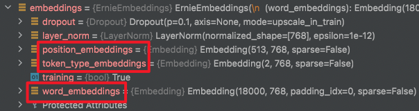

date: 2021-11-24 11:17:17
author: Jerry Su
slug: Hierarchical-Position-Embedding
title: Hierarchical Position Embedding
category: 
tags: Paddle
summary: Reason is the light and the light of life.
toc: show

预训练模型 预训练的三种embedding

word_embedding: [vocab_size, hidden_size]

position_embedding: [max_len, hidden_size]

token_type_embedding: [token_type_size, hidden_size]




```python
import paddle
```


```python
em = paddle.randn([10,8])
em
```


    Tensor(shape=[10, 8], dtype=float32, place=CPUPlace, stop_gradient=True,
           [[-1.70151997,  0.41166085,  2.07669687,  0.45709962, -0.06186785,
             -0.97549921, -0.90647888,  2.12490559],
            [ 0.40519783, -1.11712575,  1.54822433, -0.05031898, -0.51368678,
             -1.38852108, -0.02409656,  1.00319695],
            [ 0.57666051,  1.40628839, -0.56820840, -0.72696203,  2.13925982,
              0.28499472,  0.27968141, -0.67539662],
            [-0.07279679, -0.38625064,  0.30775487,  0.88405734,  0.47236541,
             -0.01491422, -0.50424761,  1.80062306],
            [ 1.34739888, -2.21111441, -1.01067805,  0.49614486,  0.94243181,
              0.26475626, -0.96289474, -1.20046675],
            [ 0.51090276,  0.54126865,  1.57957983,  0.10972761, -0.59386450,
              0.31432116, -1.26107502,  0.82878709],
            [-0.78502595, -1.61735356, -1.11995804, -0.73096234,  1.20255005,
             -1.09889698,  0.63459170,  1.03971624],
            [ 1.56938338,  0.92273849,  0.39578432, -0.37981853, -1.23813057,
             -0.55158073, -3.24209809,  0.12925054],
            [-1.13369787, -0.39774710, -0.49981558, -0.53536624,  0.75390613,
             -1.32532024, -0.64734256, -0.03006230],
            [-2.88903165,  1.16438472, -1.08206642, -0.51091170,  0.13472752,
              0.63502938, -0.84292829,  0.48817706]])


```python
em[..., :5]
```


    Tensor(shape=[10, 5], dtype=float32, place=CPUPlace, stop_gradient=True,
           [[-1.70151997,  0.41166085,  2.07669687,  0.45709962, -0.06186785],
            [ 0.40519783, -1.11712575,  1.54822433, -0.05031898, -0.51368678],
            [ 0.57666051,  1.40628839, -0.56820840, -0.72696203,  2.13925982],
            [-0.07279679, -0.38625064,  0.30775487,  0.88405734,  0.47236541],
            [ 1.34739888, -2.21111441, -1.01067805,  0.49614486,  0.94243181],
            [ 0.51090276,  0.54126865,  1.57957983,  0.10972761, -0.59386450],
            [-0.78502595, -1.61735356, -1.11995804, -0.73096234,  1.20255005],
            [ 1.56938338,  0.92273849,  0.39578432, -0.37981853, -1.23813057],
            [-1.13369787, -0.39774710, -0.49981558, -0.53536624,  0.75390613],
            [-2.88903165,  1.16438472, -1.08206642, -0.51091170,  0.13472752]])


