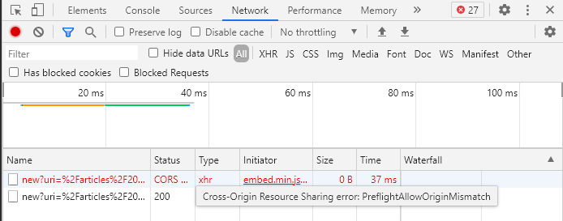

date: 2021-03-28 13:17:17
author: Jerry Su
slug: Isso-Comment-Server
title: Isso-Comment-Server
category: 
tags: Blog
summary: Reason is the light and the light of life.
toc: show

## 1. Isso as systemd service

Switch back to your privileged(root) user and create new service file.

`vim /etc/systemd/system/isso.service`
Paste the following in it.

```
[Unit]
Description=Isso Commenting Server
After=network.target
[Service]
Type=simple
User=isso
WorkingDirectory=/home/isso
ExecStart=/home/isso/.local/bin/isso -c /home/isso/isso.conf
Restart=on-failure
RestartSec=5
[Install]
WantedBy=multi-user.target
```

Enable and start the service.

`systemctl enable isso`

`systemctl start isso`

Check the status.

`systemctl status isso`


[I submit the Isso issue due to CORS](https://github.com/posativ/isso/issues/718)



[https://posativ.org/isso/](https://posativ.org/isso/)

[Apache2 Deploy Multi-sites](http://www.jerrylsu.net/articles/2021/tools-Apache2%20Deploy%20Multi-sites.html)

[https://hackriculture.fr/isso-commentaires-auto-heberges-pour-pelican-et-autres-sites-statiques.html](https://hackriculture.fr/isso-commentaires-auto-heberges-pour-pelican-et-autres-sites-statiques.html)

[https://therandombits.com/2018/12/how-to-add-isso-comments-to-your-site/](https://therandombits.com/2018/12/how-to-add-isso-comments-to-your-site/)

