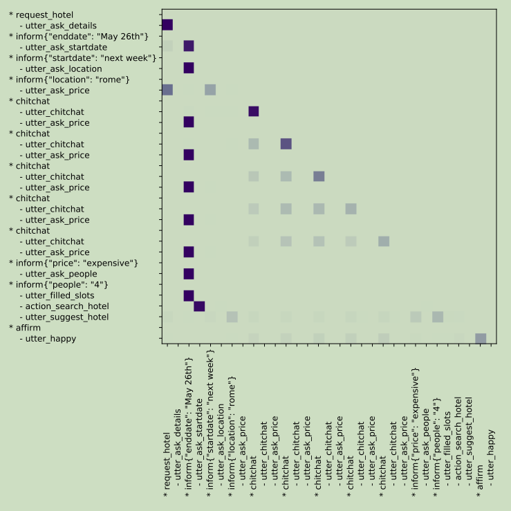

Status: published
Date: 2020-03-28 05:49:41
Author: Jerry Su
Slug: 【NLP】Attention
Title: 【NLP】Attention
Category: Attention 
Tags: Deep Learning, NLP, Attention

[TOC]


[http://jalammar.github.io/visualizing-neural-machine-translation-mechanics-of-seq2seq-models-with-attention](http://jalammar.github.io/visualizing-neural-machine-translation-mechanics-of-seq2seq-models-with-attention)


### context attention

Encoder and Decoder

```python
class Attention(nn.Module):
    def __init__(self, method, hidden_size):
        super(Attention, self).__init__()
        self.method = method
        self.hidden_size = hidden_size

        if self.method == 'general':
            self.attention = nn.Linear(self.hidden_size, self.hidden_size)
        elif self.method == 'concat':
            self.attention = nn.Linear(self.hidden_size*3, self.hidden_size)
            self.v = nn.Parameter(nn.init.normal_(torch.empty(self.hidden_size)))

    def forward(self, hidden, encoder_outputs):
        attention_energies = self.score(hidden, encoder_outputs)
        attention_energies = attention_energies.t()
        return F.softmax(attention_energies, dim=1).unsqueeze(1)

    def score(self, hidden, encoder_output):
        if self.method == 'dot':
            energy = hidden.dot(encoder_output)
            return energy
        elif self.method == 'general':
            energy = self.attention(encoder_output)
            energy = hidden.dot(energy)
            return energy
        elif self.method == 'concat':
            encoder_output = encoder_output.transpose(0, 1)
            energy = self.attention(torch.cat((hidden.expand(encoder_output.size(0), -1, -1),
                                               encoder_output), 2)).tanh()
            return torch.sum(self.v * energy, dim=2)

# attention by jerry
self.attention = Attention(attn_model, hidden_size)

# Calculate attention weights from the current RNN last hidden output
attn_weights = self.attention(last_hidden.unsqueeze(0), encoder_outputs)
# Multiply attention weights to encoder outputs to get new "weighted sum" context vector
context = attn_weights.bmm(encoder_outputs)
# Concatenate weighted context vector and GRU output using Luong eq. 5
last_hidden = last_hidden.squeeze(0)
context = context.squeeze(1)
concat_input = torch.cat((last_hidden, context), 1)
concat_output = torch.tanh(self.concat(concat_input))
```

### self attention
Encoder or Decoder

### masked self attention
Decoder 

padding masked & sequence masked


