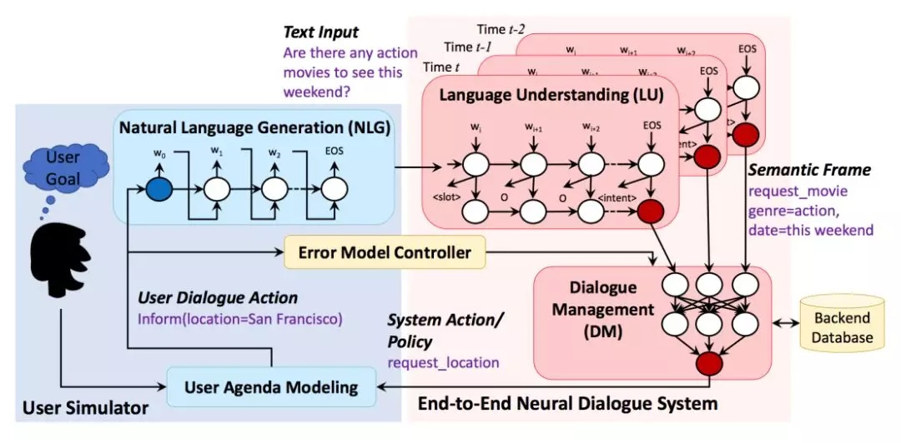

Status: published
Date: 2020-04-13 11:21:03
Author: Jerry Su
Slug: 【RL】User-Simulator
Title: 【RL】User Simulator
Category: Reinforcement Learning
Tags: Reinforcement Learning 

[TOC]

## User Simulator BackGround

NLU：自然语言 ---> 字典语义标签

DST：对话历史追踪

DP：选择对话动作
NLG：对话动作 ---> 自然语言



对话系统回复（action）---> 用户模拟器

用户模拟器与对话系统结构相似。

User goal：用户模拟器第一步首先生成对话目标。对话系统Agent对此目标不可知，但是需要通过多轮对话完成用户模拟器的目标。

e.g.  user goal = inform_slots + request_slots：

```
{ 
“request_slots”: { 
“ticket”: 	“UNK”
},
“inform_slots”: { 
“city”: 				“seattle”, 
“numberofpeople”: 	“2”, 
“theater”: 			“regal meridian 16”, 
“starttime”: 			“9:25 pm”, 
“date”: 				“tomorrow”, 
“moviename”: 		“zoolander 2”
}
}
```
信息槽：slot=value。若干槽值对，是用户用于查询的约束。

请求槽：slot。若干槽，没有信息值，用户期望通过对话从对话系统方获取的信息值。

User model：用户模型对应对话系统的对话管理模块。它的任务是根据对话历史生成当前的用户动作，用户动作是预先定义好的语义标签，例如“inform, request, greet, bye”。

Paper: End-to-End Task-Completion Neural Dialogue Systems

## Rule-Based Simulator

**Agenda-Based Simulator:**

Plato Paper: Statistical User Simulation with a Hidden Agenda

在对话过程中，用户模拟器维护着一个紧凑的，类似堆栈的表示形式，称为用户议程Agenda，其中用户状态被分解为议程A和目标G。该目标G由约束C和请求R组成。在每个时间步t处，用户模拟器都会基于当前状态和上一个代理动作生成下一个用户动作，然后更新当前状态。
当用户模拟器收到输入时，它会参考Policy/ Rule以查看将哪些内容推送到议程Agenda中，作为对输入的响应。 经过一些整理后（例如，删除重复的内容或不再有效的内容），用户模拟器会将一个或多个项目从议程Agenda中弹出作为回复。

用户模拟器维护每一轮的状态self.state，self.state具有字段request_slots, inform_slots, rest_slots, history_slots, turn, diaact

Response for Request (System Action：request_slots) 

- case1: system_action in goal.inform_slots
系统agent的问题槽在用户模拟器目标的信息槽中，1. 用目标信息槽值直接填self.state.inform_slots作为回复，2. 同时从状态self.state的剩余槽栈self.state.rest_slots中删除，3. 并清空self.state.request_slots状态的请求槽，因为已经确定为用户模拟器回答的陈述句。

- case2: system_action in goal.request_slots and not in self.state.rest_slots and in self.history_slots
系统agent的问题槽在用户模拟器目标的请求槽中，并且在用户对话状态的历史槽中，不在剩余栈槽中。表示该问题已经回答，从历史槽中取值构造回复即可。
