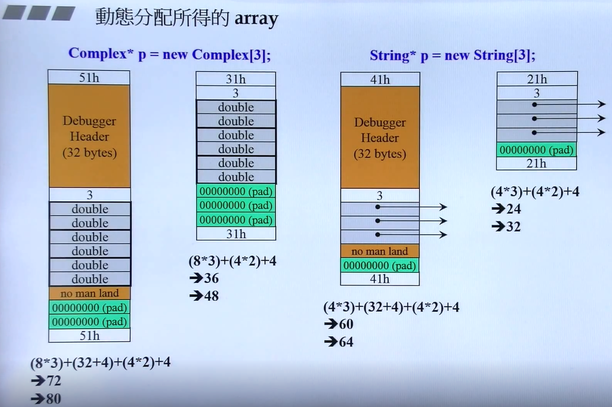
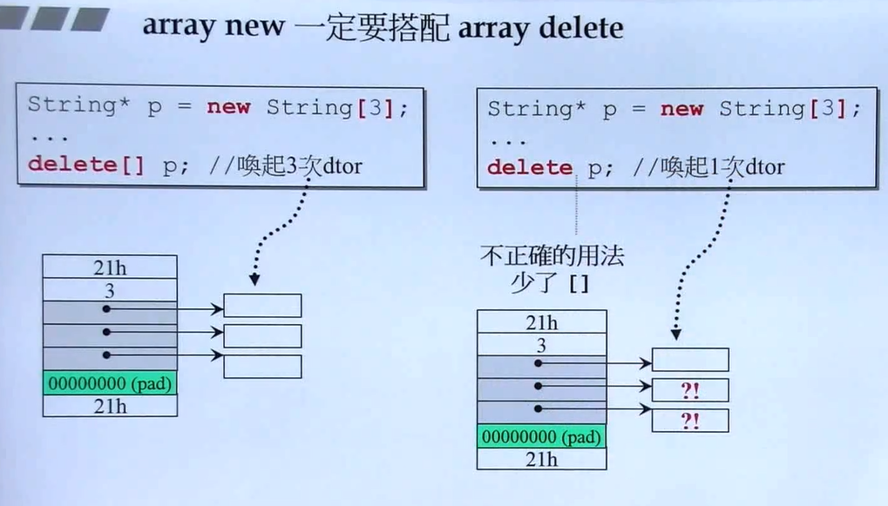

Status: published
Date: 2018-05-09 15:42:27
Author: Jerry Su
Slug: C++
Title: C++
Category: C++ 
Tags: C++

[TOC]

编写类**class**的良好习惯：

- 数据私有化**private**

- 构造函数尽量使用初始化列表**initialization list**，效率高。

- 参数与返回值尽量引用传递**by reference**，返回的值只要不是local object，尽量使用引用返回。

- 在类体中的函数需要加**const**的尽量加，不会修改成员变量。

# 基于对象的程序设计
只包含单一类的程序设计，包含两种类型的类：是否含有指针成员。

## 1.1 不含指针成员的类
**Complex class**
```cpp
#ifndef __COMPLEX__
#define __COMPLEX__

class Complex {
public:
    Complex (double r = 0, double i = 0) : re (r), im (i) { }
    Complex& operator += (const Complex&);
    double real () const { return re; }
    double imag () const { return im; }
private:
    double re, im;

    friend Complex& __doapl (Complex&, const Complex&);
};

inline Complex& __doapl (Complex* ths, const Complex& r){
    ths->re += r.re;
    ths->im += r.im;
    return *ths;
}

// class member function
inline Complex& Complex::operator += (const Complex& r){
    return __doapl (this, r);
}

// class non-member function, global function
inline Complex operator + (const Complex& x, const Complex& y){
    // temporary object, return by value
    return Complex (real (x) + real (y), imag (x) + imag (y));
}

inline Complex operator + (double x, const Complex& y){
    return Complex (x + real (y), imag (y));
}

inline Complex operator + (const Complex& x, double y){
    return Complex (real(x) + y, imag(x));
}

// class non-member function, global function
inline ostream& operator << (ostream& os, const Complex& r){
    // return by referance due to the example of `cout << c1 << c2 << endl`
    return std::cout << '(' << real(r) << ', ' << 'imag(r)' << ')';
}

#endif
```

## 1.2 含有指针成员的类
**String class**

```cpp
#ifndef __MYSTRING__
#define __MYSTRING__

#include<cstring>

class String {
public:
    // Big Three
    String(const char* cstr);             // constructor func
    String(const String& str);            // copy constructor func
    String& operator=(const String& str); // copy asignment func
    ~String();                            // destructor func
    char* get_c_str() const { return m_data; }
private:
    char* m_data;
};

inline String::String(const char* cstr = 0){
    if (cstr){
        m_data = new char[strlen(cstr) + 1];
        strcpy(m_data, cstr);
    }
    else{
        m_data = new char[1];
        *m_data = '\0';
    }
}


inline String::String(const String& str){
    m_data = new char[strlen(str.m_data) + 1];
    strcpy(m_data, str.m_data);  // deep copy
}

inline String& String::operator=(const String& str){
    // checking self-assignment
    if (this == &str){
        return *this;
    }

    delete[] m_data;  // preventing memory leak
    m_data = new char[strlen(str.m_data) + 1];
    strcpy(m_data, str.m_data);
    return *this;
}

inline String::~String(){
    delete[] m_data;
}

#include<iostream>
using namespace std;

ostream& operator<<(ostream& os, const String& str){
    os << str.get_c_str();
    return os;
}

#endif
```

## 1.3 new
**先分配内存，再调用构造函数。** new是运算符，内部调用C语言的malloc函数。

`Complex* pc = new Complex(1, 2);` 编译器转化为：
```cpp
Complex *pc;

// operator new是函数名，内部调用malloc(n)
void* mem = operator new( sizeof(Complex) );  // 1. 分配内存
pc = static_cast<Complex*>(mem);              // 2. 类型转换
pc->Complex::Complex(1, 2)                    // 3. 构造函数
// 3等价于Complex::Complex(pc, 1, 2); pc即this
```


## 1.4 delete
**先调用析构函数，再释放内存。**delete是运算符，内部调用C语言的free函数。

**注意：**delete存在两个删除动作。1.先调用析构函数，把类中动态分配的内存空间`"Hello"`删除；2.再将指向字符串的指针`ps`删除。
```cpp
String* ps = new String("Hello");
...
delete ps;
```
编译器转化为：
```cpp
String::~String(ps);                        // 析构函数
// operator delete是函数名，内部调用free(ps)
operator delete(ps);                        // 释放内存
```

**array new**与**array delete**搭配使用，否则存在内存泄漏。

