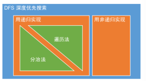

Status: published
Date: 2019-04-15 09:18:10
Author: Jerry Su
Slug: Binary-Tree
Title: Binary Tree
Category: Algorithm
Tags: Algorithm, Binary Tree

[TOC]

### 分治算法
**分治法的重点在于`问题的划分`和`返回状态的定义`**
### 遍历法 VS 分治法
1. **`递归`**是实现方式，**`遍历法`**和**`分治法`**是可以用**`递归`**实现的算法思想
2. **<font color=red>Result in parameter vs Result in return value</font>**，所以**`分治法`**一般不需要全局变量，可实现并行。
3. **`遍历法`**的结果要改参数，返回参数；**`分治法`**的结果直接返回，是个更好的接口，因为传入的参数最好不要改。
4. **`递归是自顶向下`**Top down  VS  **`分治是自底向上`**Bottom up



### 递归 VS 非递归
- 非递归其实是模拟递归用的Stack

**为什么自己模拟的可以，调用计算机的就不行呢 ？**
- 因为`heap memory ≈ memory size`，new出的stack在里面，不用担心栈溢出。
- 而`stack memory ≈ process memory`是计算机分给每个程序的一个很小的独占的空间，所以递归的深度太深，容易栈溢出。

### 前序遍历 
递归

```python
def preorderTraversal(root):
    res = []
    self.traversal(root, res)
    return res
    
def traversal(root, res):
    if not root: 
        return
    res.append(root.val)
    traversal(root.left, res)
    traversal(root.right, res)
```
**分治**

分治法的返回状态定义：**`子树的先序遍历结果 List`**

```python
def preorderTraversal(root):
    # end condition
    if not root:
        return []

    # divide & conquer
    left = preorderTraversal(root.left)
    right = preorderTraversal(root.right)

    # combine
    res = []
    res.append(root.val)
    res.extend(left)
    res.extend(right)

    # return result
    return res
```
非递归

```python
# 1. 首先把root入栈
# 2. 出栈的元素同时放进结果列表
# 3. 右左儿子依次入栈，这样出栈的顺序是先左后右（根节点已出）
# 4. 按照次序继续，直到stack为空
def preorderTraversal(root):
    if not root: 
        return []
    stack, res = [root], []
    while stack:
        node = stack.pop()
        res.append(node.val)
        if node.right:    
            stack.append(node.right)
        if node.left:
            stack.append(node.left)
    return res
```

### 中序遍历
递归

```python
def inorderTraversal(root):
    res = []
    self.traversal(root, res)
    return res
    
def traversal(root, res):
    if not root: 
        return
    traversal(root.left, res)
    res.append(root.val)
    traversal(root.right, res)
```
分治

```python
def inorderTraversal(root):
    # end condition
    if not root:
        return []

    # divide & conquer
    left = preorderTraversal(root.left)
    right = preorderTraversal(root.right)

    # combine
    res = []
    res.extend(left)
    res.append(root.val)
    res.extend(right)

    # return result
    return res
```
非递归

1. 对于任一结点`cur`，
2. 若其左孩子不为空，则将`cur`入栈并将`cur`的左孩子置为当前的`cur`，然后对当前结点`cur`再进行相同的处理；
3. 若其左孩子为空，则取栈顶元素并进行出栈操作，访问该栈顶结点，然后将当前的`cur`置为栈顶结点的右孩子；
4. 直到`cur`为`None`并且栈为空则遍历结束

```python
class Solution:
    def inorderTraversal(self, root: TreeNode) -> List[int]:
        if not root:
            return []
        
        stack = []
        cur = root
        res = []
        while stack or cur:
            if cur:      # 左子树入栈到底，找到最左孩子。
                stack.append(cur)
                cur = cur.left
            else:
                cur = stack.pop()
                res.append(cur.val)
                cur = cur.right
        return res
```

### 后序遍历
递归

```python
def postorderTraversal(root):
    res = []
    self.traversal(root, res)
    return res
    
def traversal(root, res):
    if not root: 
        return
    traversal(root.left, res)
    traversal(root.right, res)
    append(root.val)
```
分治

```python
def postorderTraversal(root):
    # end condition
    if not root:
        return []

    # divide & conquer
    left = preorderTraversal(root.left)
    right = preorderTraversal(root.right)

    # combine
    res = []
    res.extend(left)
    res.extend(right)
    res.append(root.val)

    # return result
    return res
```
非递归

```
pass
```

### 层序遍历

- 使用队列数据结构：collections.deque

- 队列初始化，根节点先入队列：queue = [root]

- 查看队列是否为空：while queue

- 如果分层打印，则先立即缓存该层大小：n = len(queue), for _ range(n)

- 遍历该层节点依次出队，查看左右孩子，存在即入队尾。

```python
Python

from collections import deque
class Solution:
    def levelOrder(self, root: TreeNode) -> List[List[int]]:
        if not root: return []
        res = []
        queue = deque()
        queue.append(root)
        while queue:
            cur_level = []
            n = len(queue)
            for _ in range(n):
                node = queue.popleft()
                cur_level.append(node.val)
                if node.left: queue.append(node.left)
                if node.right: queue.append(node.right)
            res.append(cur_level)
        return res
```

```cpp
CPP

class Solution {
public:
    vector<int> preorderTraversal(TreeNode* root) {
        vector<int> res;
        if(root == nullptr) retur res;
        stack<TreeNode*> stk;
        stk.push(root);
        while(!stk.empty()) {
            TreeNode* node = stk.top();
            stk.pop();
            res.push_back(node->val);
            if(node->right) stk.push(node->right);
            if(node->left) stk.push(node->left);
        }
        return res;
    }
};

```

### 之字层序遍历
```python
class Solution:
    def zigzagLevelOrder(self, root: TreeNode) -> List[List[int]]:
        if not root:
            return []
        res = []
        queue = collections.deque()
        queue.append(root)
        level = 0
        while queue:
            level_cur = []
            n = len(queue)
            for _ in range(n):
                node = queue.popleft()
                level_cur.append(node.val)
                if node.left: queue.append(node.left)
                if node.right: queue.append(node.right)
            res.append(level_cur if level % 2 == 0 else level_cur[::-1])
            level += 1
        return res
```

### 序列化和反序列化
```python
from collections import deque
class Codec:
    def serialize(self, root):
        if not root: return ''
        res = []
        queue = deque()  
        queue.append(root)
        while queue:
            node = queue.popleft()
            if node:
                res.append(str(node.val))
                queue.append(node.left)
                queue.append(node.right)
            else:
                res.append('#')
        return ','.join(res)

    def deserialize(self, data):
        if not data: return None
        nodes = data.split(',')
        root = TreeNode(int(nodes[0]))
        queue = deque([root])
        index = 1
        while queue:
            node = queue.popleft()
            if nodes[index] is not '#':
                node.left = TreeNode(int(nodes[index]))
                queue.append(node.left)
            index += 1
        
            if nodes[index] is not '#':
                node.right = TreeNode(int(nodes[index]))
                queue.append(node.right)
            index += 1
        return root
```

### 前中序重构二叉树

[leetcode solution](https://leetcode-cn.com/problems/construct-binary-tree-from-preorder-and-inorder-traversal/solution/cong-qian-xu-yu-zhong-xu-bian-li-xu-lie-gou-zao-9/)
```
class Solution {
public:
    TreeNode* buildTree(vector<int>& preorder, vector<int>& inorder) {
        unordered_map<int, int> map;
        int n = preorder.size();

        // 使用hash结构快速在中序遍历的结果中定位根结点的位置
        for(int i = 0; i < n; ++i) {
            map[inorder[i]] = i;
        }

        return myBuildTree(map, preorder, inorder, 0, n - 1, 0, n - 1);
    }

    TreeNode* myBuildTree(unordered_map<int, int>& map,
                        vector<int>& preorder,
                        vector<int>& inorder,
                        int preorder_left,
                        int preorder_right,
                        int inorder_left,
                        int inorder_right) {
        if(preorder_left > preorder_right || inorder_left > inorder_right) {
            return nullptr;
        }

        // 前序遍历第一个结点为根结点
        int preorder_root = preorder_left;
        // 建立根结点
        TreeNode* root = new TreeNode(preorder[preorder_root]);

        // 根结点在中序中的位置
        int inorder_root = map[preorder[preorder_root]];

        // 中序的左子树左右区间
        int inorder_sublefttree_left = inorder_left;
        int inorder_sublefttree_right = inorder_root - 1;
        // 中序的右子树左右区间
        int inorder_subrighttree_left = inorder_root + 1;
        int inorder_subrighttree_right = inorder_right;

        // 前序的左子树左右区间
        int preorder_sublefttree_left = preorder_left + 1;
        int preorder_sublefttree_right = inorder_sublefttree_right - inorder_sublefttree_left + preorder_sublefttree_left;
        // 前序的右子树左右区间
        int preorder_subrighttree_left = preorder_sublefttree_right + 1;
        int preorder_subrighttree_right = preorder_right;

        root->left = myBuildTree(map, preorder, inorder,
                                 preorder_sublefttree_left, preorder_sublefttree_right,
                                 inorder_sublefttree_left, inorder_sublefttree_right);
        root->right = myBuildTree(map, preorder, inorder,
                                  preorder_subrighttree_left, preorder_subrighttree_right,
                                  inorder_subrighttree_left, inorder_subrighttree_right);
        return root;
    }
};
```

### 二叉树最大深度

分治法的返回状态定义：**`子树的最大深度`**

```python
class Solution:
    def maxDepth(self, root):
        # end condition
        if not root:
            return 0

        # divide & conquer
        leftDepth = self.maxDepth(root.left)
        rightDepth = self.maxDepth(root.right)

        # combine：根节点的最大深度 = max(左子树最大深度，右子树最大深度) + 1
        res = max(leftDepth, rightDepth) + 1
    
        # return result
        return res
```
### 二叉树最小深度
分治法的返回状态定义：**`子树的最小深度`**

```python
class Solution:
    def minDepth(self, root: TreeNode) -> int:
        # end condition
        if not root:
            return 0
        
        if None in [root.left, root.right]:  # 需要讨论左右子树为空的情况
            
            # divide conquer
            leftDepth = self.minDepth(root.left)
            rightDepth = self.minDepth(root.right)
            
            # combine
            res = max(leftDepth, rightDepth) + 1
            
            # return result
            return res
        
        else:
            
            # divide conquer
            leftDepth = self.minDepth(root.left)
            rightDepth = self.minDepth(root.right)
            
            # combine
            res = min(leftDepth, rightDepth) + 1
            
            # return result
            return res
```
###  平衡二叉树
分治法的返回状态定义：**`子树的是否是平衡二叉树和子树的深度 (bool, int)`**

```python
class Solution:
    def isBalanced(self, root: TreeNode) -> bool:
        balance, _ = self.helper(root)
        return balance
    
    def helper(self, root):
        # end condition
        if not root:
            return True, 0
        
        # divide conquer
        leftBalance, leftDepth = self.helper(root.left)
        rightBalance, rightDepth = self.helper(root.right)       
        
        # combine & return result
        if not leftBalance: return False, 0
        if not rightBalance: return False, 0
        return abs(leftDepth - rightDepth) <= 1, max(leftDepth, rightDepth) + 1
```

### 二叉搜索树 BST
二叉搜索树基本性质
- 定义：左子树都比根节点小，右子树都不小于根节点。左右子树也必须是BST。单节点树是BST。
- BST的中序遍历是**`不降序列`**

### 二叉搜索树最近公共祖先
```python
class Solution:
    def lowestCommonAncestor(self, root: 'TreeNode', p: 'TreeNode', q: 'TreeNode') -> 'TreeNode':
        if not root: return None
        if root.val > p.val and root.val > q.val:
            return self.lowestCommonAncestor(root.left, p, q)
        if root.val < p.val and root.val < q.val:
            return self.lowestCommonAncestor(root.right, p, q)
        else:
            return root  # 包含p或q就是root和p，q在root两边情况。
```

### 二叉树的最近公共祖先
1. 我们自底部遍历，一旦我们到达一个与两个节点之一匹配的节点，我们就将它传递给它的父节点。
2. 否则，在左右孩子中查找：
   - 如果左右孩子均返回一个节点，p和q存在，root就是LCA。
   - 如果只有其中一个孩子返回一个节点，意味着在左或右分支上找到p或q。
   - 如果左右孩子均没返回节点，则返回None。

只有一个返回节点情况理解：假设在左孩子返回p，右孩子返回None。这意味着q位于节点p下面的某处，其中p被发现我们不需要一直搜索，因为在这种情况下，找到p的节点是LCA。

分治法的返回状态定义：**`找到的 p节点 或 q节点`**
```python
class Solution:
    def lowestCommonAncestor(self, root: 'TreeNode', p: 'TreeNode', q: 'TreeNode') -> 'TreeNode':
        # end condition
        if root in [None, p, q]:
            return root
        
        # divide conquer
        left = self.lowestCommonAncestor(root.left, p, q)
        right = self.lowestCommonAncestor(root.right, p ,q)
        
        # conbine & return result
        return root if left and right else left or right
```
### Same Tree
```python
class Solution:
    def isSameTree(self, p, q):
        if not p and not q:
            return True
        if not p or not q:
            return False
        if p.val != q.val:
            return False
        
        return self.isSameTree(p.left, q.left) and self.isSameTree(p.right, q.right)
```
### Subtree of Another Tree
DST + DST
```python
class Solution:
    def isSubtree(self, s: TreeNode, t: TreeNode) -> bool:
        if not s and not t:
            return True
        if not s or not t:
            return False
        
        return self.isSameTree(s, t) or self.isSubtree(s.left, t) or self.isSubtree(s.right, t)
```
### Binary Tree Maximum Path Sum
返回状态的定义：`maxPathSum`, `singlePathSum`
- 首先，想一个简化版(single path)，找从root到任意点得最大值。类似于maxDepth，每次加root.val而不再是+1
- 求单路的时候，如果root加左儿子单路或者右儿子单路最后的值都小于0，则返回0，意味着不要root开始的这个单路了
- 本题思路 divide & conquer
求最大路径和就等于下面三个值的最大值：
  - 左子树的最大路径和
  - 右子树的最大路径和
  - 左子树单路 + 右子树单路 + root.val
```python
class Solution(object):
    def maxPathSum(self, root):
        if not root: return 0
        res, _ = self.helper(root)
        return res
        
    def helper(self, root):
        if not root:
            return -0x7fffffff, 0
            
        left = self.helper(root.left)
        right = self.helper(root.right)
        singlePathSum = max(left[1] + root.val, right[1] + root.val, 0)
        maxPathSum = max(left[0], right[0], left[1] + right[1] + root.val)
        return maxPathSum, singlePathSum
```


思路二：DFS，返回状态的定义：
**`dfs(root)返回的是包括root这个结点的单一路径上的最大值。`** 

则可能的结果有：
- left + right +root.val (左右子树和根构成路径为最大值）
- max(left, right) + root.val(左或者右子树和根构成最大值）
- root.val本身为最大值

和全局变量res比较更新即可。

需要注意的是dfs返回值，可能是
- max(left, right) + root.val 某一条路径
- root.val  只是该结点（下面都是负的了）
```python
class Solution:
    def maxPathSum(self, root: TreeNode) -> int:
        if not root: return 0
        self.res = -0x7fffffff
        self.helper(root)
        return self.res
    
    def helper(self, root: TreeNode):
        if not root:
            return -0x7fffffff
        left = self.helper(root.left)
        right = self.helper(root.right)

        if left + right + root.val > self.res: self.res=  left + right + root.val
        if max(left, right) + root.val> self.res: self.res= max(left, right)+ root.val     
        if root.val > self.res: self.res=root.val  
        
        return max(max(left, right) + root.val, root.val)
```
