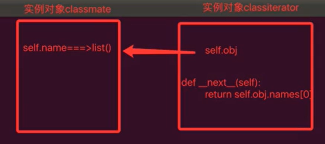

Status: published
Date: 2020-06-11 12:19:28
Author: Jerry Su
Slug: Iterator
Title: Iterator
Category: Python 
Tags: Python

[TOC]

### Iterator



iter(): 接收的是可迭代对象，返回的是迭代器。

next(): 接收的是迭代器，调用的是迭代器对象中的next函数，返回数据元素。

由于生成器是一种特殊的迭代器，故而用next()而不是iter()。

```python
class Classmate(object):
    def __init__(self):
        self.names = list()

    def add(self, name):
        self.names.append(name)

    def __iter__(self):
        # 返回迭代器对象
        return ClassIterator(self)

class ClassIterator(object):
    def __init__(self, obj):
        self.obj = obj
        self.cur = 0

    # 包含__iter__的方法对象成可迭代iterable
    def __iter__(self):
        pass

    # 包含__next__的方法对象成迭代器iterator
    def __next__(self):
        if self.cur < len(self.obj.names):
            res = self.obj.names[self.cur]
            self.cur += 1
            return res
        else:
            raise StopIteration
```

**优化：去除迭代器ClassIterator，将Classmate写成迭代器，返回自身self即可。**
```python
from collections import Iterable
import time

class Classmate(object):
    def __init__(self):
        self.names = list()
        self.cur = 0

    def add(self, name):
        self.names.append(name)

    def __iter__(self):
        return self

    def __next__(self):
        if self.cur < len(self.names):
            res = self.names[self.cur]
            self.cur += 1
            return res
        else:
            raise StopIteration


if __name__ == '__main__':
    classmate = Classmate()
    classmate.add('Jerry')
    classmate.add('Annie')
    classmate.add('Sophie')
    print('Iterable: {}'.format(isinstance(classmate, Iterable)))

    for temp in classmate:
        print(temp)
        time.sleep(1)
```

**Fibonacci数列，迭代器定义生成数据的方法，在访问的时候产生数据，节省内存。**
```python
class Fibonacci(object):
    def __init__(self, num):
        self.num = num
        self.cur = 0
        self.a = 0
        self.b = 1

    def __iter__(self):
        return self

    def __next__(self):
        if self.cur < self.num:
            res = self.a
            self.a, self.b = self.b, self.a + self.b
            self.cur += 1
            return res
        else:
            raise StopIteration


if __name__ == '__main__':
    fibo = Fibonacci(10)
    for num in fibo:
        print(num)
```

### Generator

生成器是特殊的迭代器。含有yield关键字的函数，不再是函数而是生成器。调用时不再是函数调用而是创建生成器对象。

yield关键字，将函数暂停，当下次访问时，接着yield后面继续执行。

```python
def generator(n):
    cur = 0
    a, b = 0, 1
    while cur < n:
        yield a
        a, b = b, a + b
        cur += 1

# 并非调用函数，而是创建生成器对象
obj = generator(10)

# next()函数传递的是迭代器，而生成器是一种特殊的迭代器
ret = next(obj)
print(ret)
```